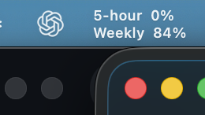
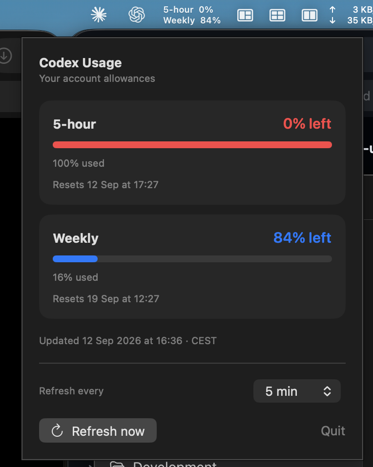

# Codex Usage for macOS

A native menu bar app showing your remaining five-hour and weekly Codex allowances. Click the menu bar item for usage bars, reset dates in your Mac's local timezone, and refresh controls.

## Usage at a glance



The two compact rows show your **remaining allowance**: **5-hour** on top and **Weekly** below. The values above are an example from the screenshot; the widget fetches your own account’s usage.

### Details panel

Click either row to open the details panel.



The panel includes:

- **Usage bars:** see the percentage used and remaining for each allowance.
- **Reset times:** see when each window resets, in your Mac’s local timezone.
- **Refresh controls:** refresh immediately or choose a 1, 5, 15, 30, or 60-minute interval.
- **Update status:** see the last refresh time and a warning if an update fails.

## Download

[Download Codex Usage 1.1 for macOS](downloads/Codex-Usage-1.1-macOS.zip?raw=true) · [Source ZIP](downloads/Codex-Usage-1.1-source.zip?raw=true)

Supports macOS 13+ on Apple Silicon and Intel. Requires Python 3.9+ and your own Codex ChatGPT sign-in. Unzip, copy **Codex Usage.app** to Applications, and launch it from Spotlight.

**This app is not Apple notarized.** macOS may block downloaded copies. You can review and build the source locally. See [sharing and privacy details](SHARING.md). Checksums are in [downloads](downloads/).

## Run

For a stable location outside synced folders, run `./install.sh`. This builds, installs into `~/Applications`, verifies the signature, and launches the app. It refuses to overwrite an existing installation.

The build also produces `build/Codex Usage.app`. Double-click it, or run:

```sh
open "build/Codex Usage.app"
```

It refreshes immediately, every five minutes by default, and after waking from sleep. Choose 1, 5, 15, 30, or 60 minutes in the popover; your choice is saved. The app must remain running to refresh. Quit stops polling. Failed refreshes retain the previous values and show a warning. No cached values are loaded at startup.

To start at login, add the app in macOS System Settings → General → Login Items. Keep it at a stable location, or copy it into Applications first.

## Build

Requires macOS 13+, Xcode command line tools, Python 3.9+, and a Codex installation signed in with your ChatGPT account.

```sh
./build.sh
```

The app detects Python on the recipient’s Mac at launch and requires Python 3.9+. The build produces a universal Apple Silicon/Intel binary targeting macOS 13+. It is ad-hoc signed, not Apple notarized. See [sharing instructions](SHARING.md) for installation, privacy, and distribution limitations.

After building, run `python3 scripts/package_release.py` to create audited app and source ZIPs in `dist/`. Only explicitly allowed files are included; release packaging rejects absolute home-directory paths and unexpected bundle files.

## Script

```sh
python3 scripts/fetch_usage.py
python3 scripts/fetch_usage.py --watch 300
```

Each run writes one JSON object to stdout. `--watch` repeats until interrupted. Failures return an `error` object; one-shot failures exit nonzero. Set `CODEX_BINARY` to override executable discovery when invoking from a shell.

The reader starts a temporary `codex app-server`, initializes its JSON-RPC connection, and calls only `account/rateLimits/read`. It uses Codex's existing authentication without reading or copying credentials, generating model turns, or spending reset credits. It prefers `rateLimitsByLimitId` and supports the legacy response. A 25-second timeout bounds requests, and the temporary server is stopped afterward.

Protocol reference: [OpenAI Codex App Server](https://learn.chatgpt.com/docs/app-server).

## Tests

```sh
python3 -m unittest discover -s tests -v
```

Tests cover multi-bucket and legacy responses, unavailable values, the handshake, notifications, and timeouts. The Codex app-server interface can change; rebuild or update the reader if a future Codex version changes it.

## License

[GNU GPL v3](LICENSE). This is an unofficial utility, not affiliated with OpenAI.
